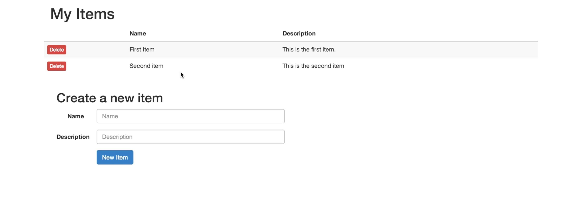

# To-do app but in a purely-functional style

Written in Clojurescript using the Re-frame framework, connecting to a Postgres SQL database!This project is part of my studies on programming paradigms, this project specifically for purely functional programming. Based [this](https://purelyfunctional.tv/courses/web-dev-in-clojure/) tutorial by [PurelyFunctionalTv.](https://purelyfunctional.tv/)

Demo Photo: 

